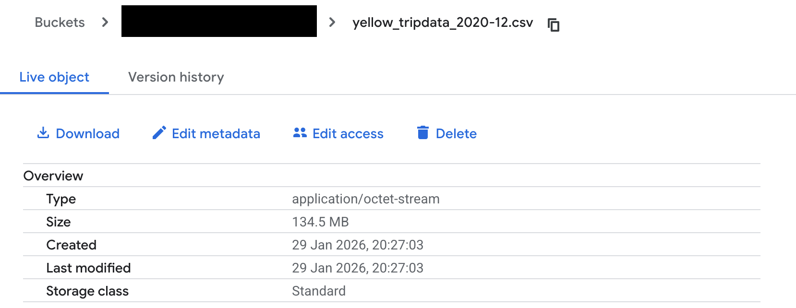
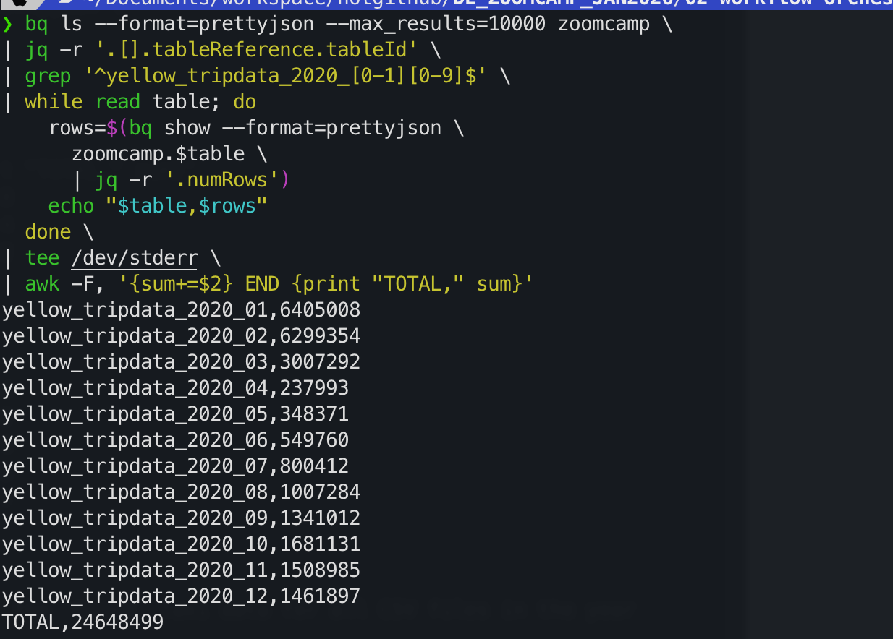
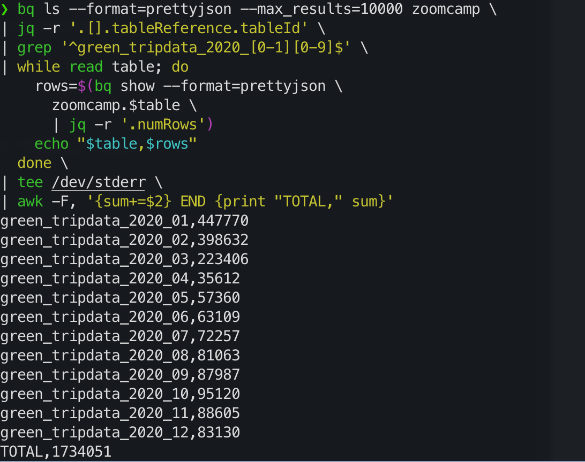
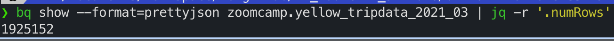
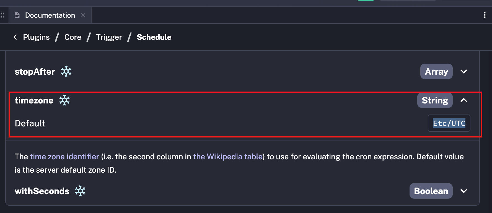

### Quiz Questions

Complete the quiz shown below. It's a set of 6 multiple-choice questions to test your understanding of workflow orchestration, Kestra, and ETL pipelines.

1) Within the execution for `Yellow` Taxi data for the year `2020` and month `12`: what is the uncompressed file size (i.e. the output file `yellow_tripdata_2020-12.csv` of the `extract` task)?

- 128.3 MiB
- 134.5 MiB
- 364.7 MiB
- 692.6 MiB

```
Ans is --> 134.5 MB 
UPDATE: 
ans is 128.3 MiB, 
note that the question asks MiB and not MB, 
MiB is 1024 x 1024(exact powers of 2) and MB is 1000 x 1000 (decimal)..
GCP is showing MB and not MiB
```
--

--

2) What is the rendered value of the variable `file` when the inputs `taxi` is set to `green`, `year` is set to `2020`, and `month` is set to `04` during execution?

- `{{inputs.taxi}}_tripdata_{{inputs.year}}-{{inputs.month}}.csv` 
- `green_tripdata_2020-04.csv`
- `green_tripdata_04_2020.csv`
- `green_tripdata_2020.csv`

```
Ans is --> 
green_tripdata_2020-04.csv

```


3) How many rows are there for the `Yellow` Taxi data for all CSV files in the year 2020?

- 13,537.299
- 24,648,499
- 18,324,219
- 29,430,127

```
Ans is --> 24648499

❯ bq ls --format=prettyjson --max_results=10000 zoomcamp \
| jq -r '.[].tableReference.tableId' \
| grep '^yellow_tripdata_2020_[0-1][0-9]$' \
| while read table; do
    rows=$(bq show --format=prettyjson \
      zoomcamp.$table \
      | jq -r '.numRows')
    echo "$table,$rows"
  done \
| tee /dev/stderr \
| awk -F, '{sum+=$2} END {print "TOTAL," sum}'
yellow_tripdata_2020_01,6405008
yellow_tripdata_2020_02,6299354
yellow_tripdata_2020_03,3007292
yellow_tripdata_2020_04,237993
yellow_tripdata_2020_05,348371
yellow_tripdata_2020_06,549760
yellow_tripdata_2020_07,800412
yellow_tripdata_2020_08,1007284
yellow_tripdata_2020_09,1341012
yellow_tripdata_2020_10,1681131
yellow_tripdata_2020_11,1508985
yellow_tripdata_2020_12,1461897
TOTAL,24648499
```
--

--

4) How many rows are there for the `Green` Taxi data for all CSV files in the year 2020?

- 5,327,301
- 936,199
- 1,734,051
- 1,342,034

```
Ans is --> 1734051
❯ bq ls --format=prettyjson --max_results=10000 zoomcamp \
| jq -r '.[].tableReference.tableId' \
| grep '^green_tripdata_2020_[0-1][0-9]$' \
| while read table; do
    rows=$(bq show --format=prettyjson \
      zoomcamp.$table \
      | jq -r '.numRows')
    echo "$table,$rows"
  done \
| tee /dev/stderr \
| awk -F, '{sum+=$2} END {print "TOTAL," sum}'
green_tripdata_2020_01,447770
green_tripdata_2020_02,398632
green_tripdata_2020_03,223406
green_tripdata_2020_04,35612
green_tripdata_2020_05,57360
green_tripdata_2020_06,63109
green_tripdata_2020_07,72257
green_tripdata_2020_08,81063
green_tripdata_2020_09,87987
green_tripdata_2020_10,95120
green_tripdata_2020_11,88605
green_tripdata_2020_12,83130
TOTAL,1734051

```
--

--

5) How many rows are there for the `Yellow` Taxi data for the March 2021 CSV file?

- 1,428,092
- 706,911
- 1,925,152
- 2,561,031

```
Ans is --> 1925152
 bq show --format=prettyjson zoomcamp.yellow_tripdata_2021_03 | jq -r '.numRows'
1925152
```

--

--

6) How would you configure the timezone to New York in a Schedule trigger?

- Add a `timezone` property set to `EST` in the `Schedule` trigger configuration  
- Add a `timezone` property set to `America/New_York` in the `Schedule` trigger configuration
- Add a `timezone` property set to `UTC-5` in the `Schedule` trigger configuration
- Add a `location` property set to `New_York` in the `Schedule` trigger configuration  

```
Ans is --> Add a `timezone` property set to `America/New_York` in the `Schedule` trigger configuration

```
--

--

### Lesson notes - Self


Initial steps
```
mkdir 02-workflow-orchestration
cd 02-workflow-orchestration
docker compose up -d
```


Use docker compose from the DE git repo 
```
https://github.com/DataTalksClub/data-engineering-zoomcamp/blob/main/02-workflow-orchestration/docker-compose.yml
```

download the flows as well:
```
https://github.com/DataTalksClub/data-engineering-zoomcamp/tree/main/02-workflow-orchestration/flows
```


to import all flows (that we downloaded) programmatically into Kestra do

```
# Import all flows: assuming username admin@kestra.io and password Admin1234 (adjust to match your username and password)
curl -X POST -u 'admin@kestra.io:Admin1234' http://localhost:8080/api/v1/flows/import -F fileUpload=@flows/01_hello_world.yaml
curl -X POST -u 'admin@kestra.io:Admin1234' http://localhost:8080/api/v1/flows/import -F fileUpload=@flows/02_python.yaml
curl -X POST -u 'admin@kestra.io:Admin1234' http://localhost:8080/api/v1/flows/import -F fileUpload=@flows/03_getting_started_data_pipeline.yaml
curl -X POST -u 'admin@kestra.io:Admin1234' http://localhost:8080/api/v1/flows/import -F fileUpload=@flows/04_postgres_taxi.yaml
curl -X POST -u 'admin@kestra.io:Admin1234' http://localhost:8080/api/v1/flows/import -F fileUpload=@flows/05_postgres_taxi_scheduled.yaml
curl -X POST -u 'admin@kestra.io:Admin1234' http://localhost:8080/api/v1/flows/import -F fileUpload=@flows/06_gcp_kv.yaml
curl -X POST -u 'admin@kestra.io:Admin1234' http://localhost:8080/api/v1/flows/import -F fileUpload=@flows/07_gcp_setup.yaml
curl -X POST -u 'admin@kestra.io:Admin1234' http://localhost:8080/api/v1/flows/import -F fileUpload=@flows/08_gcp_taxi.yaml
curl -X POST -u 'admin@kestra.io:Admin1234' http://localhost:8080/api/v1/flows/import -F fileUpload=@flows/09_gcp_taxi_scheduled.yaml
curl -X POST -u 'admin@kestra.io:Admin1234' http://localhost:8080/api/v1/flows/import -F fileUpload=@flows/10_chat_without_rag.yaml
curl -X POST -u 'admin@kestra.io:Admin1234' http://localhost:8080/api/v1/flows/import -F fileUpload=@flows/11_chat_with_rag.yaml
```

Two issues (for me) in kestra's flow ```07_gcp_setup```:

1. secrets isn't available in the free so use use kv for now - before this i added an env value suggested in 
```https://kestra.io/docs/how-to-guides/google-credentials?clid=eyJpIjoiYmhwZ1NJR0Rpb05ORGw1OWZaOFlCIiwiaCI6IiIsInAiOiIvZGUtem9vbWNhbXAvZ29vZ2xlLXNhIiwidCI6MTc2OTYyMTM5N30.4QZ0-46vYGG45YLCHmX_AQbSYxLhCJCu3xuENiX327M
```
and set the .env_encoded file inside of your docker-compose.yml:
kestra: ```env_file: .env_encoded```. i could see the env var inside the docker instance shell but cant use ``` "{{ secret('GCP_SERVICE_ACCOUNT') }}" ``` in the kestra flow. this did not work.

2. kept getting ```Project <PROJECT_NO here> may not create storageClass REGIONAL buckets with locationConstraint US.``` so i changed the flow to omit region and location

```
id: 07_gcp_setup
namespace: zoomcamp

tasks:
  - id: create_gcs_bucket
    type: io.kestra.plugin.gcp.gcs.CreateBucket
    ifExists: SKIP
    name: "{{kv('GCP_BUCKET_NAME')}}" # make sure it's globally unique!

  - id: create_bq_dataset
    type: io.kestra.plugin.gcp.bigquery.CreateDataset
    name: "{{kv('GCP_DATASET')}}"
    ifExists: SKIP

pluginDefaults:
  - type: io.kestra.plugin.gcp
    values:
      serviceAccount: "{{ kv('SECRET_GCP_SERVICE_ACCOUNT') }}"
      projectId: "{{kv('GCP_PROJECT_ID')}}"
      bucket: "{{kv('GCP_BUCKET_NAME')}}"

```


**Below Flow uses subflow for extracting 2020 data and 2021 march data into gcs and bq**

```
id: 08_gcp_taxi_batch_run
namespace: zoomcamp

description: >
  Runs 08_gcp_taxi for: - All months of 2020 for yellow and green taxis - Yellow taxi for March 2021

tasks:
  - id: each_run
    type: io.kestra.plugin.core.flow.ForEach
    values: >
      [
        {"taxi":"yellow","year":"2020","month":"01"},
        {"taxi":"yellow","year":"2020","month":"02"},
        {"taxi":"yellow","year":"2020","month":"03"},
        {"taxi":"yellow","year":"2020","month":"04"},
        {"taxi":"yellow","year":"2020","month":"05"},
        {"taxi":"yellow","year":"2020","month":"06"},
        {"taxi":"yellow","year":"2020","month":"07"},
        {"taxi":"yellow","year":"2020","month":"08"},
        {"taxi":"yellow","year":"2020","month":"09"},
        {"taxi":"yellow","year":"2020","month":"10"},
        {"taxi":"yellow","year":"2020","month":"11"},
        {"taxi":"yellow","year":"2020","month":"12"},

        {"taxi":"green","year":"2020","month":"01"},
        {"taxi":"green","year":"2020","month":"02"},
        {"taxi":"green","year":"2020","month":"03"},
        {"taxi":"green","year":"2020","month":"04"},
        {"taxi":"green","year":"2020","month":"05"},
        {"taxi":"green","year":"2020","month":"06"},
        {"taxi":"green","year":"2020","month":"07"},
        {"taxi":"green","year":"2020","month":"08"},
        {"taxi":"green","year":"2020","month":"09"},
        {"taxi":"green","year":"2020","month":"10"},
        {"taxi":"green","year":"2020","month":"11"},
        {"taxi":"green","year":"2020","month":"12"},

        {"taxi":"yellow","year":"2021","month":"03"}
      ]

    tasks:
      - id: run_08_gcp_taxi
        type: io.kestra.plugin.core.flow.Subflow
        namespace: zoomcamp
        flowId: 08_gcp_taxi
        inputs:
          taxi: "{{ json(taskrun.value).taxi }}"
          year: "{{ json(taskrun.value).year }}"
          month: "{{ json(taskrun.value).month }}"

```


