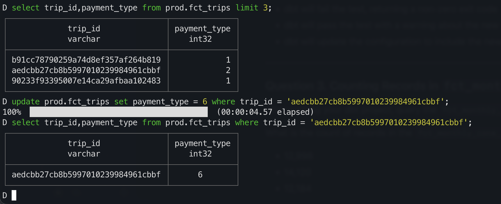
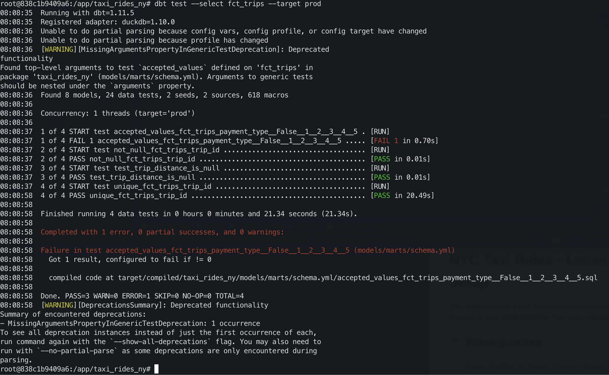
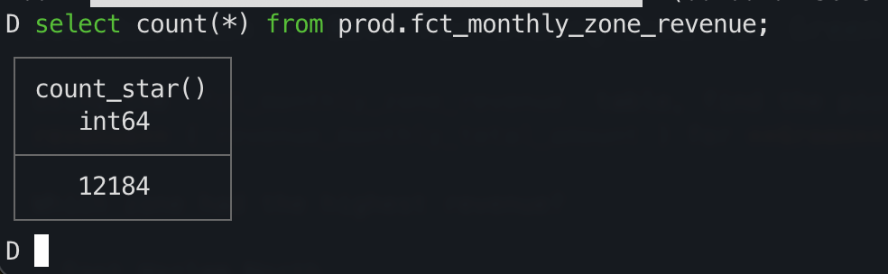
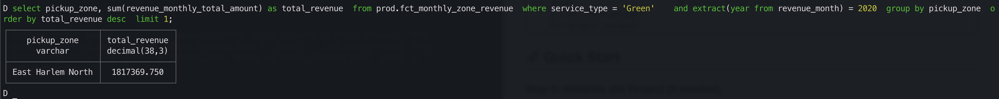
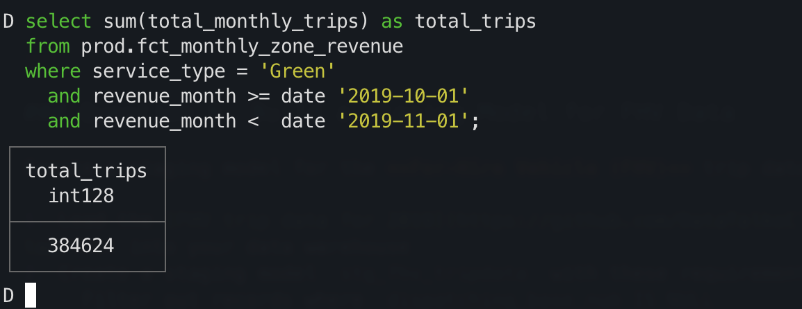
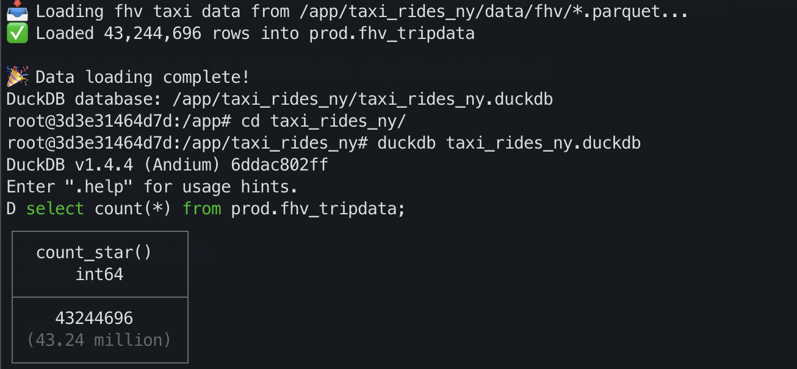

# Module 4: Analytics Engineering with dbt

In this homework, we'll use the dbt project in `04-analytics-engineering/taxi_rides_ny/` to transform NYC taxi data and answer questions by querying the models.

## Setup

1. Set up your dbt project following the [setup guide](../../../04-analytics-engineering/setup/)
2. Load the Green and Yellow taxi data for 2019-2020 into your warehouse
3. Run `dbt build --target prod` to create all models and run tests

> **Note:** By default, dbt uses the `dev` target. You must use `--target prod` to build the models in the production dataset, which is required for the homework queries below.

After a successful build, you should have models like `fct_trips`, `dim_zones`, and `fct_monthly_zone_revenue` in your warehouse.

---

### Question 1. dbt Lineage and Execution

Given a dbt project with the following structure:

```
models/
├── staging/
│   ├── stg_green_tripdata.sql
│   └── stg_yellow_tripdata.sql
└── intermediate/
    └── int_trips_unioned.sql (depends on stg_green_tripdata & stg_yellow_tripdata)
```

If you run `dbt run --select int_trips_unioned`, what models will be built?

- `stg_green_tripdata`, `stg_yellow_tripdata`, and `int_trips_unioned` (upstream dependencies)
- Any model with upstream and downstream dependencies to `int_trips_unioned`
- `int_trips_unioned` only
- `int_trips_unioned`, `int_trips`, and `fct_trips` (downstream dependencies)


```
Ans --> `int_trips_unioned` only
REASON: 
The --select flag tells dbt exactly what to run, not what dependencies to include.
To include dependencies, use different syntax:
# Include upstream (dependencies)
dbt run --select +int_trips_unioned

# Include downstream (models that depend on it)
dbt run --select int_trips_unioned+

# Include both upstream and downstream
dbt run --select +int_trips_unioned+

The syntax:

model_name - Just that model
+model_name - Model + all upstream dependencies
model_name+ - Model + all downstream dependents
+model_name+ - Model + upstream + downstream (full lineage)

Why this design:
Sometimes you want to rebuild just one model without touching dependencies:

Dependencies already built correctly
Testing a specific model change
Faster iteration

If you always rebuilt dependencies, every single model run would rebuild the entire DAG from scratch.
```
---

### Question 2. dbt Tests

You've configured a generic test like this in your `schema.yml`:

```yaml
columns:
  - name: payment_type
    data_tests:
      - accepted_values:
          arguments:
            values: [1, 2, 3, 4, 5]
            quote: false
```

Your model `fct_trips` has been running successfully for months. A new value `6` now appears in the source data.

What happens when you run `dbt test --select fct_trips`?

- dbt will skip the test because the model didn't change
- dbt will fail the test, returning a non-zero exit code
- dbt will pass the test with a warning about the new value
- dbt will update the configuration to include the new value

```
Ans -->  dbt will fail the test, returning a non-zero exit code
REASON: see screenshots below
```
data prep

error appears

---

### Question 3. Counting Records in `fct_monthly_zone_revenue`

After running your dbt project, query the `fct_monthly_zone_revenue` model.

What is the count of records in the `fct_monthly_zone_revenue` model?

- 12,998
- 14,120
- 12,184
- 15,421

```
Ans --> 12,184
REASON: see screenshot
```

---

### Question 4. Best Performing Zone for Green Taxis (2020)

Using the `fct_monthly_zone_revenue` table, find the pickup zone with the **highest total revenue** (`revenue_monthly_total_amount`) for **Green** taxi trips in 2020.

Which zone had the highest revenue?

- East Harlem North
- Morningside Heights
- East Harlem South
- Washington Heights South

```
Ans --> East Harlem North
REASON: select pickup_zone, sum(revenue_monthly_total_amount) as total_revenue  from prod.fct_monthly_zone_revenue  where service_type = 'Green'    and extract(year from revenue_month) = 2020  group by pickup_zone  order by total_revenue desc  limit 1;
see screenshot
```

---

### Question 5. Green Taxi Trip Counts (October 2019)

Using the `fct_monthly_zone_revenue` table, what is the **total number of trips** (`total_monthly_trips`) for Green taxis in October 2019?

- 500,234
- 350,891
- 384,624
- 421,509

```
Ans --> 384,624
REASON: 
select sum(total_monthly_trips) as total_trips
from prod.fct_monthly_zone_revenue
where service_type = 'Green'
  and revenue_month >= date '2019-10-01'
  and revenue_month <  date '2019-11-01';

```


---

### Question 6. Build a Staging Model for FHV Data

Create a staging model for the **For-Hire Vehicle (FHV)** trip data for 2019.

1. Load the [FHV trip data for 2019](https://github.com/DataTalksClub/nyc-tlc-data/releases/tag/fhv) into your data warehouse
2. Create a staging model `stg_fhv_tripdata` with these requirements:
   - Filter out records where `dispatching_base_num IS NULL`
   - Rename fields to match your project's naming conventions (e.g., `PUlocationID` → `pickup_location_id`)

What is the count of records in `stg_fhv_tripdata`?

- 42,084,899
- 43,244,693
- 22,998,722
- 44,112,187

```
Ans --> 43,244,693
REASON: select count(*) from prod.fhv_tripdata;
```

---


# NYC Taxi Rides - Local(not cloud) - dbt + DuckDB Docker Setup

This setup provides a fully containerized environment for running dbt with DuckDB. Data is downloaded and converted to Parquet on your **local machine**, then automatically loaded into DuckDB inside Docker on first run.

## 📋 Prerequisites

- Docker Desktop (or Docker Engine + Docker Compose)
- Python 3.8+ with pip (for local data download)
- At least 4GB RAM allocated to Docker
- At least 10GB free disk space for data

## 🗂️ Project Structure

```
.
├── Dockerfile                  # Python environment with dbt-duckdb
├── docker-compose.yml          # Service configuration
├── profiles.yml                # dbt profile for DuckDB connection
├── entrypoint.sh               # Auto-loads data on first Docker run
├── download_data.py            # LOCAL: Download and convert to Parquet
├── ingest_data.py                # DOCKER: Load Parquet into DuckDB
├── taxi_rides_ny/              # Your dbt project directory
│   ├── dbt_project.yml
│   ├── models/
│   └── taxi_rides_ny.duckdb    # Created on first run
└── data/                       # Parquet files (created locally)
    ├── yellow/*.parquet
    └── green/*.parquet
```

## 🚀 Quick Start

### Step 0: Initialize dbt Project (if needed)

If you don't already have a `taxi_rides_ny/` dbt project:
```bash
# Install dbt locally (temporary, just for init)
pip install dbt-core dbt-duckdb

# Initialize the project
dbt init taxi_rides_ny

# Choose:
# - Database: duckdb
# - Other settings: use defaults
```
This creates the basic dbt project structure. You can uninstall dbt locally after this if you want - Docker will handle it from here.

If your project uses dbt packages, install them locally:
```bash
cd taxi_rides_ny

# Add packages to packages.yml if needed, then:
dbt deps
```

The `dbt_packages/` folder will be mounted into Docker automatically.
```

**Under "🗂️ Project Structure"**, update to show:

```
└── taxi_rides_ny/              # Your dbt project directory
    ├── dbt_project.yml
    ├── packages.yml            # dbt package dependencies
    ├── dbt_packages/           # Installed packages (created by dbt deps)
    ├── models/
    └── ...
```

**Add to ".gitignore section" (if there's a gitignore discussion):**
```
# Add to your .gitignore
dbt_packages/
target/
logs/


### Step 1: Install Local Dependencies

Install Python packages needed for data download (on your local machine):

```bash
pip install duckdb requests
```

### Step 2: Download and Convert Data (LOCAL)

Run this **on your local machine** (NOT in Docker):

```bash
python download_data.py
```

This will:
- Download NYC taxi data (yellow and green) for 2019-2020
- Convert CSV files to Parquet format
- Save to `./data/yellow/` and `./data/green/`
- Takes 10-20 minutes depending on your internet connection

**This only needs to be done ONCE.** The Parquet files persist on your machine.

### Step 3: Build Docker Image

```bash
docker-compose build --no-cache
```

### Step 4: Start Container (Auto-loads Data)

```bash
docker-compose run --rm dbt bash
```

**On first run**, the entrypoint script will:

- Detect this is the first startup
- Automatically load Parquet files into DuckDB
- Create `prod.yellow_tripdata` and `prod.green_tripdata` tables
- run `dbt seed`
- Create a marker to prevent re-loading

On subsequent runs, data loading is skipped (already loaded).

### Step 5: Verify Setup

Inside the container:

```bash
# Test dbt connection
dbt debug

# Query the data
duckdb taxi_rides_ny.duckdb
```

Then in DuckDB:
```sql
SELECT COUNT(*) FROM prod.yellow_tripdata;
SELECT COUNT(*) FROM prod.green_tripdata;
.exit
```

### Step 6: Run dbt Models

```bash
# Inside the container
dbt build --target prod --full-refresh
```

### Troubleshooting
Inside the container, run 

```
dbt seed --select payment_type_lookup  # Reload specific seed
dbt seed --full-refresh  # Force complete reload

```

## 🛠️ Common Workflows

### Running dbt Commands

```bash
# One-off command
docker-compose run --rm dbt dbt run

# Interactive shell (better for multiple commands)
docker-compose run --rm dbt bash
# Now inside container:
dbt run --target prod
dbt test
dbt docs generate
```

### Accessing DuckDB Directly

```bash
docker-compose run --rm dbt duckdb taxi_rides_ny.duckdb
```

### Rebuilding Docker Image

When you make changes to the Dockerfile:

```bash
# Rebuild the image
docker-compose build --no-cache

# Remove the data loaded marker to force re-load
rm taxi_rides_ny/.data_loaded

# Start container (will re-load data)
docker-compose run --rm dbt bash
```

## 🔄 Data Flow

```
LOCAL MACHINE                           DOCKER CONTAINER
─────────────────                       ────────────────
1. download_data.py  
   ↓
2. data/yellow/*.parquet  ──mount──→   3. entrypoint.sh (first run)
   data/green/*.parquet                    ↓
                                        4. load_data.py
                                           ↓
                                        5. taxi_rides_ny.duckdb
                                           - prod.yellow_tripdata
                                           - prod.green_tripdata
```

## 🎯 Key Differences from Previous Setup

| Aspect | Old Approach | New Approach |
|--------|-------------|--------------|
| **Download** | Inside Docker | On local machine |
| **Conversion** | Inside Docker | On local machine |
| **DuckDB Load** | Manual command | Automatic on first run |
| **Re-run safety** | Re-downloads files | Uses existing Parquet |
| **Image rebuild** | No re-download | No re-download |

## 📦 What Happens Where?

### On Your Local Machine:
- ✅ Download CSV files
- ✅ Convert to Parquet
- ✅ Store in `./data/`
- ✅ Parquet files are mounted (read-only) into Docker

### Inside Docker Container:
- ✅ Load Parquet into DuckDB (first run only)
- ✅ Run dbt transformations
- ✅ DuckDB file persists in `./taxi_rides_ny/`

## 🧹 Cleanup

### Remove Docker resources only
```bash
docker-compose down
docker rmi $(docker images -q dbt-duckdb)
```

### Remove everything (including downloaded data)
```bash
# Docker cleanup
docker-compose down

# Remove local data
rm -rf data/
rm -rf taxi_rides_ny/taxi_rides_ny.duckdb
rm -rf taxi_rides_ny/.data_loaded
```

## 🔧 Troubleshooting

### Data not loading on first run?
```bash
# Check if Parquet files exist locally
ls data/yellow/*.parquet
ls data/green/*.parquet

# If missing, run download script
python download_data.py
```

### Force re-load of data
```bash
# Remove the marker file
rm taxi_rides_ny/.data_loaded

# Restart container
docker-compose run --rm dbt bash
```

### Image keeps re-downloading data
This shouldn't happen! The download only occurs on your local machine via `download_data.py`, not during Docker build or run.

### Out of memory errors
Increase Docker's RAM allocation:
- **Docker Desktop**: Settings → Resources → Memory → 4GB+

## 💡 Why This Approach?

1. **Faster image rebuilds**: Data download/conversion isn't part of the Docker build
2. **Reusable data**: Parquet files on your local machine can be used for other projects
3. **Efficient**: No re-downloading when you rebuild the image
4. **Transparent**: You can inspect/verify the Parquet files locally
5. **One-time setup**: First container run auto-loads data, subsequent runs skip it

## 📚 Resources
- [DataTalksClub Week 4](https://github.com/DataTalksClub/data-engineering-zoomcamp/tree/main/04-analytics-engineering)
- [dbt Documentation](https://docs.getdbt.com/)
- [DuckDB Documentation](https://duckdb.org/docs/)
- [Docker Compose Documentation](https://docs.docker.com/compose/)

---

Happy analyzing! 🦆📊