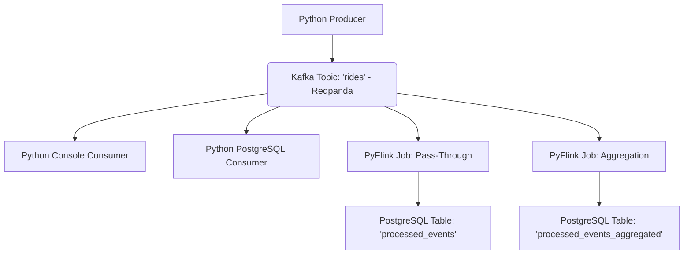

# PyFlink: Stream Processing Workshop with Redpanda and PostgreSQL

This workshop guides you through building a real-time streaming data pipeline using PyFlink, Redpanda (a Kafka-compatible broker), and PostgreSQL. You will learn fundamental concepts of stream processing, including producers, consumers, and Flink's capabilities for data transformation and aggregation with time windows and watermarks.

The content is based on the [2025 stream with Zach Wilson](https://www.youtube.com/watch?v=P2loELMUUeI).

## Prerequisites

Before you begin, ensure you have the following installed:

*   **Docker and Docker Compose:** For running Redpanda, PostgreSQL, and Flink services.
*   **uv:** A fast Python package manager. If not installed, follow instructions at [https://docs.astral.sh/uv/](https://docs.astral.sh/uv/).
*   **A SQL client:** `pgcli` (install with `uvx pgcli`), DBeaver, pgAdmin, or DataGrip to interact with PostgreSQL.

## Core Components

*   **Redpanda:** A high-performance, Kafka-compatible streaming data platform. It acts as our message broker.
*   **PostgreSQL:** A robust relational database used as a sink for processed data.
*   **PyFlink:** The Python API for Apache Flink, a powerful stream processing framework for real-time analytics and transformations.

## Overall Data Flow

The workshop progresses through different stages of a data pipeline:



## Setup

1.  **Initialize Python Environment:**
    If you cloned this repository, the `pyproject.toml` already exists. Sync dependencies:
    ```bash
    uv sync
    ```
    If starting from scratch, initialize a new project and add dependencies:
    ```bash
    uv init -p 3.12
    uv add kafka-python pandas pyarrow psycopg2-binary
    ```

2.  **Prepare Flink Build Files:**
    Ensure the following files are in your workshop directory. If not, download them:
    ```bash
    PREFIX="https://raw.githubusercontent.com/DataTalksClub/data-engineering-zoomcamp/main/07-streaming/workshop"
    wget ${PREFIX}/Dockerfile.flink
    wget ${PREFIX}/pyproject.flink.toml
    wget ${PREFIX}/flink-config.yaml
    ```

3.  **Create `src/job` directory:**
    This is important to prevent permission issues with Docker volume mounts.
    ```bash
    mkdir -p src/job
    ```

4.  **Start Docker Services:**
    This command builds the custom Flink Docker image and starts Redpanda, PostgreSQL, JobManager, and TaskManager containers. This might take a few minutes the first time.
    ```bash
    docker compose up --build -d
    ```

5.  **Verify Services:**
    Check that all services are running:
    ```bash
    docker compose ps
    ```
    You should see `redpanda`, `jobmanager`, `taskmanager`, and `postgres` all in an `Up` state.
    Access the Flink dashboard at [http://localhost:8081](http://localhost:8081).

## Step-by-Step Learning Path

### Step 1: Produce Messages to Kafka (Redpanda)

This step introduces how to send data to a Kafka topic using a Python producer. We'll use historical NYC taxi trip data.

*   **File to inspect:** `src/producers/producer.py`
    *   This script reads a Parquet file, converts each row into a `Ride` dataclass object (defined in `src/models.py`), serializes it to JSON, and sends it to the `rides` Kafka topic.
*   **Execute:**
    ```bash
    uv run python src/producers/producer.py
    ```
    You will see messages printed to the console as they are sent to Redpanda.

### Step 2: Consume Messages with Python (Console Consumer)

Learn how to read messages from a Kafka topic using a simple Python consumer and print them to the console.

*   **File to inspect:** `src/consumers/consumer.py`
    *   This script connects to the `rides` topic, deserializes the JSON messages back into `Ride` objects, and prints their details. It uses `auto_offset_reset='earliest'` to read all available messages from the beginning of the topic.
*   **Execute:**
    ```bash
    uv run python src/consumers/consumer.py
    ```
    You will see the first 10 messages consumed and printed.

### Step 3: Consume Messages and Save to PostgreSQL

This step demonstrates how to persist Kafka messages into a PostgreSQL database using a Python consumer.

*   **File to inspect:** `src/consumers/consumer_postgres.py`
    *   This script extends the basic consumer by establishing a connection to PostgreSQL and inserting each consumed `Ride` event into a `processed_events` table.
*   **Prepare PostgreSQL Table:**
    Connect to your PostgreSQL instance (e.g., using `uvx pgcli -h localhost -p 5432 -U postgres -d postgres` with password `postgres`) and create the table:
    ```sql
    CREATE TABLE processed_events (
        PULocationID INTEGER,
        DOLocationID INTEGER,
        trip_distance DOUBLE PRECISION,
        total_amount DOUBLE PRECISION,
        pickup_datetime TIMESTAMP
    );
    ```
*   **Execute:**
    ```bash
    uv run python src/producers/producer.py # Send more data if needed
    uv run python src/consumers/consumer_postgres.py
    ```
    (Press `Ctrl+C` after it processes the data).
*   **Verify in PostgreSQL:**
    ```sql
    SELECT count(*) FROM processed_events;
    ```
    You should see the count of messages inserted.
*   **Cleanup:**
    ```sql
    TRUNCATE processed_events;
    ```

### Step 4: Process Data with PyFlink (Pass-Through Job)

Now, we introduce PyFlink to handle stream processing. This job will read from Kafka and write to PostgreSQL, similar to the Python consumer, but leveraging Flink's fault tolerance and scalability.

*   **File to inspect:** `src/job/pass_through_job.py`
    *   This PyFlink job defines a Kafka source table and a PostgreSQL sink table using Flink SQL DDL. It then uses an `INSERT INTO ... SELECT` statement to move data from Kafka to PostgreSQL, converting the timestamp format. It also enables checkpointing for fault tolerance.
*   **Submit Flink Job:**
    ```bash
    docker compose exec jobmanager ./bin/flink run \
        -py /opt/src/job/pass_through_job.py \
        --pyFiles /opt/src -d
    ```
    Note the `JobID` returned. You can monitor the job in the Flink UI ([http://localhost:8081](http://localhost:8081)).
*   **Send Data:**
    Since the Flink job is configured to read from `latest-offset`, send new data:
    ```bash
    uv run python src/producers/producer.py
    ```
*   **Verify in PostgreSQL:**
    ```sql
    SELECT count(*) FROM processed_events;
    ```
    You should see the new messages processed by Flink.
*   **Experiment with Offsets:**
    *   Cancel the Flink job from the UI.
    *   Clear the `processed_events` table (`TRUNCATE processed_events;`).
    *   Edit `src/job/pass_through_job.py` to change `'scan.startup.mode'` and `'properties.auto.offset.reset'` to `'earliest-offset'`.
    *   Resubmit the job and observe Flink processing all historical data.
    *   **Remember to change offsets back to `latest-offset` for the next steps.**

### Step 5: Aggregation with PyFlink (Tumbling Windows)

This is where Flink's power for stream analytics shines. We'll perform time-windowed aggregations.

*   **File to inspect:** `src/job/aggregation_job.py`
    *   This PyFlink job reads from the Kafka `rides` topic, defines an `event_timestamp` and a `WATERMARK` for handling out-of-order events. It then uses a `TUMBLE` window function to aggregate `num_trips` and `total_revenue` by `PULocationID` within 1-hour windows. The results are written to a new PostgreSQL table with a `PRIMARY KEY` to support upserts (updates to previously emitted window results).
*   **Prepare PostgreSQL Table:**
    Connect to PostgreSQL and create the aggregated table:
    ```sql
    CREATE TABLE processed_events_aggregated (
        window_start TIMESTAMP,
        PULocationID INTEGER,
        num_trips BIGINT,
        total_revenue DOUBLE PRECISION,
        PRIMARY KEY (window_start, PULocationID)
    );
    ```
*   **Submit Flink Job:**
    First, cancel any running Flink jobs from the UI. Then submit:
    ```bash
    docker compose exec jobmanager ./bin/flink run \
        -py /opt/src/job/aggregation_job.py \
        --pyFiles /opt/src -d
    ```
*   **Send Data:**
    ```bash
    uv run python src/producers/producer.py
    ```
*   **Verify in PostgreSQL:**
    Wait ~15 seconds for the windows to close, then query:
    ```sql
    SELECT window_start, count(*) as locations, sum(num_trips) as total_trips,
           round(sum(total_revenue)::numeric, 2) as revenue
    FROM processed_events_aggregated
    GROUP BY window_start
    ORDER BY window_start;
    ```
    You will see aggregated results for each hour and pickup location.
*   **Cleanup:**
    ```sql
    TRUNCATE processed_events_aggregated;
    ```

### Step 6: Real-time Producer and Aggregation Demo

Observe Flink's watermark and upsert behavior with a real-time data stream that includes late events.

*   **Files to inspect:**
    *   `src/producers/producer_realtime.py`: Generates synthetic taxi ride events with current timestamps, but occasionally introduces "late" events (events with a timestamp a few seconds in the past) to simulate real-world scenarios.
    *   `src/job/aggregation_job_demo.py`: A Flink job similar to `aggregation_job.py`, but configured with shorter 10-second tumbling windows for quicker observation of watermarks and late event handling.
*   **Submit Flink Job:**
    First, cancel any running Flink jobs from the UI. Then submit the demo aggregation job:
    ```bash
    docker compose exec jobmanager ./bin/flink run \
        -py /opt/src/job/aggregation_job_demo.py \
        --pyFiles /opt/src -d
    ```
*   **Run Real-time Producer (Terminal 1):**
    ```bash
    uv run python src/producers/producer_realtime.py
    ```
    Observe the output indicating "on time" and "LATE" events.
*   **Monitor Aggregations (Terminal 2):**
    In a separate terminal, continuously monitor the aggregated results in PostgreSQL:
    ```bash
    watch -n 1 'PGPASSWORD=postgres docker compose exec postgres psql -U postgres -d postgres -c "SELECT window_start, sum(num_trips) as trips, round(sum(total_revenue)::numeric, 2) as revenue FROM processed_events_aggregated GROUP BY window_start ORDER BY window_start;"'
    ```
    You will observe the `num_trips` and `total_revenue` for specific `window_start` values increasing over time, even for older windows, as late events arrive and Flink updates the results via upserts. This demonstrates the power of watermarks and primary keys in handling out-of-order data.
*   **Cleanup:**
    Stop both the producer (`Ctrl+C`) and the `watch` command (`Ctrl+C`). Cancel the Flink job from the UI.
    ```sql
    TRUNCATE processed_events_aggregated;
    ```

## Cleanup

To stop and remove all Docker containers and networks created by this workshop:

```bash
docker compose down
```

To also remove the PostgreSQL data volume (this will delete all data in your PostgreSQL container):

```bash
docker compose down -v
```

## Key Concepts & Q&A

### Why Flink? What does it add beyond simple Kafka consumers?

For basic "read and write" tasks, a Kafka consumer is sufficient. However, Flink excels in scenarios requiring:
*   **Windowing:** Built-in support for tumbling, sliding, and session windows for time-based aggregations.
*   **Checkpointing:** Automatic state management and fault tolerance, ensuring data consistency and recovery from failures without manual offset tracking.
*   **Parallelism:** Distributes processing across multiple workers for scalability.
*   **Connectors:** Rich ecosystem of connectors for various sources and sinks (Kafka, JDBC, filesystems, etc.), reducing boilerplate code.
*   **SQL Interface:** Allows expressing complex stream processing logic using SQL queries.

### What are Watermarks and how do they handle late events?

In stream processing, events can arrive out of order or with delays. A **Watermark** is a mechanism in Flink that signals the progress of event time. It tells Flink when it can consider a certain time window "complete" and emit its results.

*   **Patience for Lateness:** Our jobs use `WATERMARK for event_timestamp as event_timestamp - INTERVAL '5' SECOND`. This means Flink will wait an additional 5 seconds beyond an event's timestamp before closing a window. Events arriving within this 5-second "grace period" are included.
*   **Upserts for Very Late Events:** For events arriving *after* the watermark has closed a window (i.e., beyond the grace period), Flink can still process them. If the sink table has a `PRIMARY KEY` (like our `processed_events_aggregated` table), Flink will issue an UPDATE (upsert) to correct the previously emitted aggregation for that window. Without a primary key, very late events might be dropped or lead to duplicate entries.

### What's the difference between `earliest-offset` and `latest-offset`?

These settings determine where a Flink job (or Kafka consumer) starts reading from a Kafka topic:
*   **`earliest-offset`:** Starts reading from the very beginning of the topic. Useful for backfilling historical data or when you want to reprocess all data.
*   **`latest-offset`:** Starts reading from the most recent message available when the job begins. This is common for real-time processing where you only care about new events.

### When do we actually need streaming vs. micro-batching?

While Flink provides true continuous streaming, many use cases can be served by micro-batch processing (e.g., Spark Streaming). The choice depends on your latency requirements:
*   **Streaming (low latency):** Necessary when automated processes need to react to data in near real-time (e.g., fraud detection, dynamic pricing, real-time recommendations).
*   **Micro-batching (higher latency, simpler):** Often sufficient for dashboards, reporting, or less time-sensitive analytics where a few seconds or minutes of delay are acceptable.

Consider the operational overhead: streaming jobs run 24/7 and require robust monitoring and on-call support.

### Flink vs. Spark Streaming?

*   **Flink:** Designed for true continuous stream processing (push-based), offering lower latency and more advanced state management.
*   **Spark Streaming:** Traditionally micro-batch based (pull-based), processing data in small, discrete batches. While newer versions offer continuous processing, its core is still batch-oriented.

### `uv` vs. `pip`?

`uv` is a modern, fast Python package manager written in Rust, designed as a drop-in replacement for `pip` and `venv`. It offers significantly faster dependency resolution and package installation.

### `kafka-python` vs. `confluent-kafka-python`?

*   **`kafka-python`:** A pure Python implementation, easier to install with no C dependencies. Suitable for most workshop and basic use cases.
*   **`confluent-kafka-python`:** A wrapper around `librdkafka` (a C library), offering higher performance and more features, often preferred for production-grade applications.
