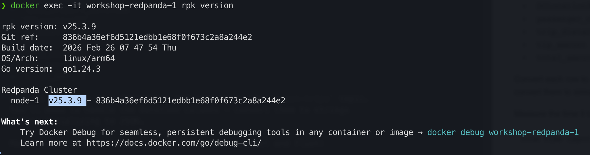
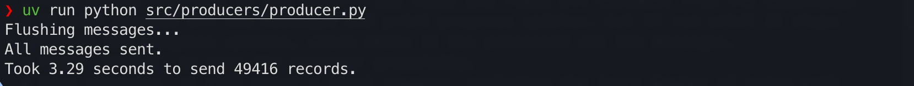
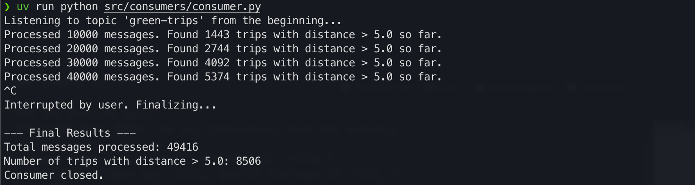
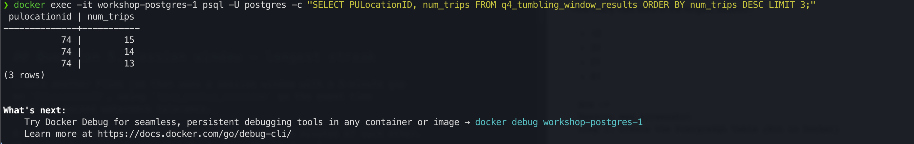
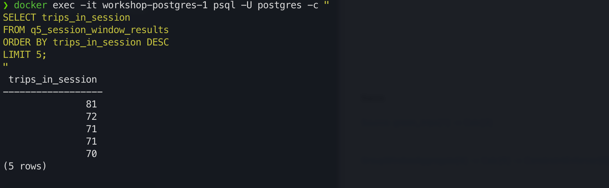
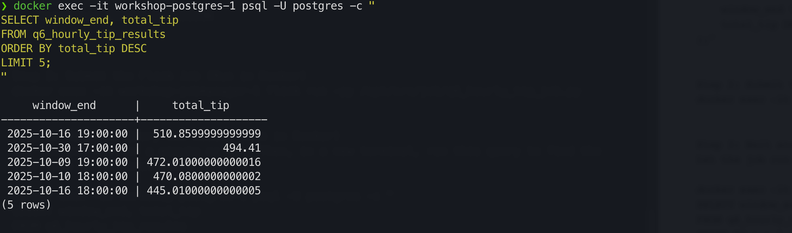

# Homework

In this homework, we'll practice streaming with Kafka (Redpanda) and PyFlink.

We use Redpanda, a drop-in replacement for Kafka. It implements the same
protocol, so any Kafka client library works with it unchanged.

For this homework we will be using Green Taxi Trip data from October 2025:

- [green_tripdata_2025-10.parquet](https://d37ci6vzurychx.cloudfront.net/trip-data/green_tripdata_2025-10.parquet)


## Setup

We'll use the same infrastructure from the [workshop](../../../07-streaming/workshop/).

Follow the setup instructions: build the Docker image, start the services:

```bash
cd 07-streaming/workshop/
docker compose build
docker compose up -d
```

This gives us:

- Redpanda (Kafka-compatible broker) on `localhost:9092`
- Flink Job Manager at http://localhost:8081
- Flink Task Manager
- PostgreSQL on `localhost:5432` (user: `postgres`, password: `postgres`)

If you previously ran the workshop and have old containers/volumes,
do a clean start:

```bash
docker compose down -v
docker compose build
docker compose up -d
```

Note: the container names (like `workshop-redpanda-1`) assume the
directory is called `workshop`. If you renamed it, adjust accordingly.


## Question 1. Redpanda version

Run `rpk version` inside the Redpanda container:

```bash
docker exec -it workshop-redpanda-1 rpk version
```

What version of Redpanda are you running?

```
Ans -> v25.3.9
Reason: see screenshot
```


## Question 2. Sending data to Redpanda

Create a topic called `green-trips`:

```bash
docker exec -it workshop-redpanda-1 rpk topic create green-trips
```

Now write a producer to send the green taxi data to this topic.

Read the parquet file and keep only these columns:

- `lpep_pickup_datetime`
- `lpep_dropoff_datetime`
- `PULocationID`
- `DOLocationID`
- `passenger_count`
- `trip_distance`
- `tip_amount`
- `total_amount`

Convert each row to a dictionary and send it to the `green-trips` topic.
You'll need to handle the datetime columns - convert them to strings
before serializing to JSON.

Measure the time it takes to send the entire dataset and flush:

```python
from time import time

t0 = time()

# send all rows ...

producer.flush()

t1 = time()
print(f'took {(t1 - t0):.2f} seconds')
```


How long did it take to send the data?

- 10 seconds
- 60 seconds
- 120 seconds
- 300 seconds

```
Ans -> 10 seconds
Reason: see screenshot
place the green data parquet file in workshop/data
run below in workshop directory
uv run python src/producers/producer.py

What it Verifies:
* This script reads the entire parquet file, converts each row to a JSON message, and sends it to the green-trips topic in Redpanda.
* The output will end with a line like: Took XX.XX seconds to send YYYY records.
```



## Question 3. Consumer - trip distance

Write a Kafka consumer that reads all messages from the `green-trips` topic
(set `auto_offset_reset='earliest'`).

Count how many trips have a `trip_distance` greater than 5.0 kilometers.

How many trips have `trip_distance` > 5?

- 6506
- 7506
- 8506
- 9506

```
Ans -> 8506
Reason: see screenshot
Question 2 command must be run
run below in workshop directory
uv run python src/consumers/consumer.py

What it Verifies:
* This script connects to the green-trips topic and reads all messages from the beginning.
* It will process all the messages and print progress updates. Let it run until it stops printing new progress updates, which means it has processed all the messages.
* Press `Ctrl+C` to stop the consumer gracefully.
* Upon stopping, it will print a final summary, including the line: Number of trips with distance > 5.0: ZZZZ
* ZZZZ is the ans
```



## Part 2: PyFlink (Questions 4-6)

For the PyFlink questions, you'll adapt the workshop code to work with
the green taxi data. The key differences from the workshop:

- Topic name: `green-trips` (instead of `rides`)
- Datetime columns use `lpep_` prefix (instead of `tpep_`)
- You'll need to handle timestamps as strings (not epoch milliseconds)

You can convert string timestamps to Flink timestamps in your source DDL:

```sql
lpep_pickup_datetime VARCHAR,
event_timestamp AS TO_TIMESTAMP(lpep_pickup_datetime, 'yyyy-MM-dd HH:mm:ss'),
WATERMARK FOR event_timestamp AS event_timestamp - INTERVAL '5' SECOND
```

Before running the Flink jobs, create the necessary PostgreSQL tables
for your results.

Important notes for the Flink jobs:

- Place your job files in `workshop/src/job/` - this directory is
  mounted into the Flink containers at `/opt/src/job/`
- Submit jobs with:
  `docker exec -it workshop-jobmanager-1 flink run -py /opt/src/job/your_job.py`
- The `green-trips` topic has 1 partition, so set parallelism to 1
  in your Flink jobs (`env.set_parallelism(1)`). With higher parallelism,
  idle consumer subtasks prevent the watermark from advancing.
- Flink streaming jobs run continuously. Let the job run for a minute
  or two until results appear in PostgreSQL, then query the results.
  You can cancel the job from the Flink UI at http://localhost:8081
- If you sent data to the topic multiple times, delete and recreate
  the topic to avoid duplicates:
  `docker exec -it workshop-redpanda-1 rpk topic delete green-trips`


## Question 4. Tumbling window - pickup location

Create a Flink job that reads from `green-trips` and uses a 5-minute
tumbling window to count trips per `PULocationID`.

Write the results to a PostgreSQL table with columns:
`window_start`, `PULocationID`, `num_trips`.

After the job processes all data, query the results:

```sql
SELECT PULocationID, num_trips
FROM <your_table>
ORDER BY num_trips DESC
LIMIT 3;
```

Which `PULocationID` had the most trips in a single 5-minute window?

- 42
- 74
- 75
- 166

```
Ans -> 74
Reason: see screenshot
  
Step 1: Create the PostgreSQL Table (Run in Docker)
Execute this command in your local terminal to create the table Flink will write to.

docker exec -it workshop-postgres-1 psql -U postgres -c "
CREATE TABLE q4_tumbling_window_results (
    window_start TIMESTAMP,
    PULocationID INT,
    num_trips BIGINT
);"


Step 2: Submit the Flink Job (Run in Docker)
This command tells the Flink Job Manager to execute your Python script.

docker exec -it workshop-jobmanager-1 flink run -py /opt/src/job/q4_tumbling_window_job.py


Step 3: Wait and Query the Result (Run in Docker)
The job will run continuously. Let it run for a minute or two to process the data from Kafka. Then, run this command in a new terminal window to query the results and find the answer.

docker exec -it workshop-postgres-1 psql -U postgres -c "
SELECT PULocationID, num_trips
FROM q4_tumbling_window_results
ORDER BY num_trips DESC
LIMIT 3;
"
```



## Question 5. Session window - longest streak

Create another Flink job that uses a session window with a 5-minute gap
on `PULocationID`, using `lpep_pickup_datetime` as the event time
with a 5-second watermark tolerance.

A session window groups events that arrive within 5 minutes of each other.
When there's a gap of more than 5 minutes, the window closes.

Write the results to a PostgreSQL table and find the `PULocationID`
with the longest session (most trips in a single session).

How many trips were in the longest session?

- 12
- 31
- 51
- 81

```
Ans -> 81
Reason: see screenshot
Step 1: Create the PostgreSQL Table (Run in Docker)

docker exec -it workshop-postgres-1 psql -U postgres -c "
CREATE TABLE q5_session_window_results (
    session_start TIMESTAMP,
    session_end TIMESTAMP,
    PULocationID INT,
    trips_in_session BIGINT
 );"


Step 2: Submit the Flink Job (Run in Docker)
docker exec -it workshop-jobmanager-1 flink run -py /opt/src/job/q5_session_window_job.py


Step 3: Wait and Query the Result (Run in Docker)
Let the job run for a minute or two. Then, in a new terminal, run this query to find the longest session.

docker exec -it workshop-postgres-1 psql -U postgres -c "
SELECT trips_in_session
FROM q5_session_window_results
ORDER BY trips_in_session DESC
LIMIT 5;
"
```



## Question 6. Tumbling window - largest tip

Create a Flink job that uses a 1-hour tumbling window to compute the
total `tip_amount` per hour (across all locations).

Which hour had the highest total tip amount?

- 2025-10-01 18:00:00
- 2025-10-16 18:00:00
- 2025-10-22 08:00:00
- 2025-10-30 16:00:00

```
Ans -> 2025-10-16 18:00:00 (note, screenshot times are in UTC, 1 hr ahead of NYC data)
Reason: see screenshot

Step 1: Create the PostgreSQL Table (Run in Docker)
docker exec -it workshop-postgres-1 psql -U postgres -c "
CREATE TABLE q6_hourly_tip_results (
    window_end TIMESTAMP,
    total_tip DOUBLE PRECISION
);"


Step 2: Submit the Flink Job (Run in Docker)
docker exec -it workshop-jobmanager-1 flink run -py /opt/src/job/q6_hourly_tip_job.py


Step 3: Wait and Query the Result (Run in Docker)
Let the job run for a minute or two. Then, in a new terminal, run this query to find the hour with the highest total tip.

docker exec -it workshop-postgres-1 psql -U postgres -c "
SELECT window_end, total_tip
FROM q6_hourly_tip_results
ORDER BY total_tip DESC
LIMIT 5;
"
```

