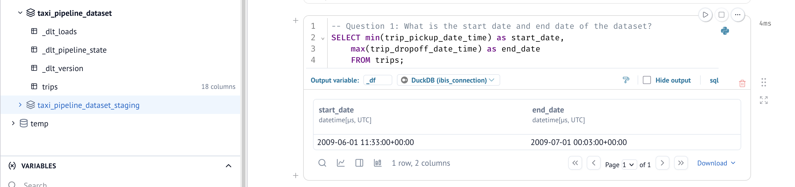
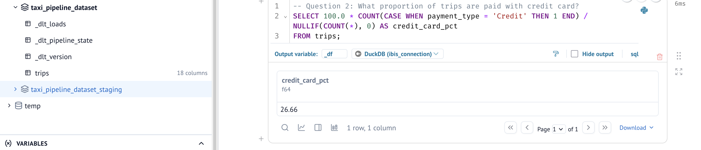
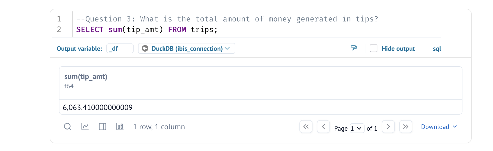

### Question 1: What is the start date and end date of the dataset?

- 2009-01-01 to 2009-01-31
- 2009-06-01 to 2009-07-01
- 2024-01-01 to 2024-02-01
- 2024-06-01 to 2024-07-01

```
Ans -> 2009-06-01 to 2009-07-01
Reason: See screenshot
```


### Question 2: What proportion of trips are paid with credit card?

- 16.66%
- 26.66%
- 36.66%
- 46.66%

```
Ans -> 26.66%
Reason: See screenshot
```



### Question 3: What is the total amount of money generated in tips?

- $4,063.41
- $6,063.41
- $8,063.41
- $10,063.41

```
Ans -> $6,063.41
Reason: See screenshot
```

